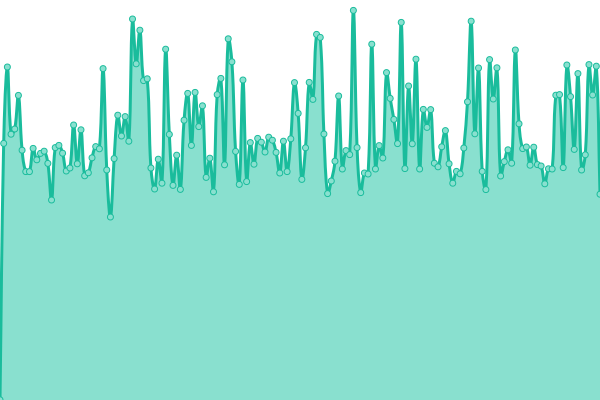
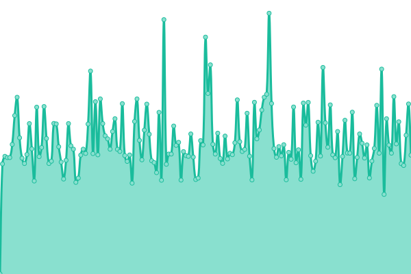
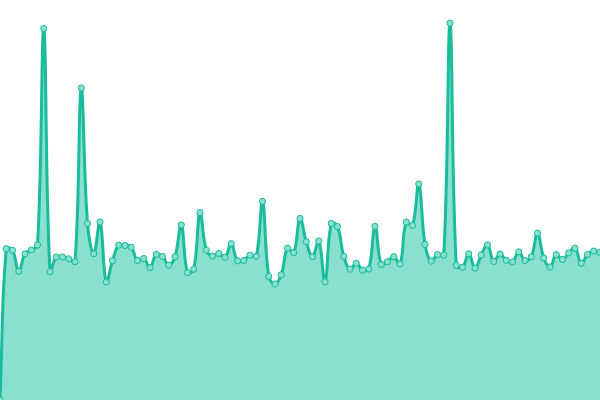
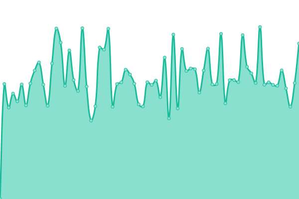
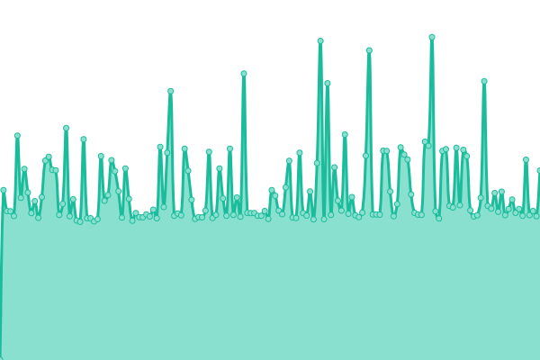
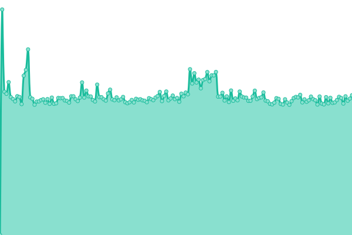
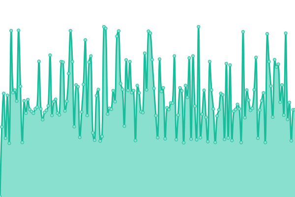

# [📈 Live Status](https://telabotanica.github.io/status): <!--live status--> **🟧 Partial outage**

This repository contains the open-source uptime monitor and status page for [Tela Botanica](http://www.tela-botanica.org), powered by [Upptime](https://github.com/upptime/upptime).

With [Upptime](https://upptime.js.org), you can get your own unlimited and free uptime monitor and status page, powered entirely by a GitHub repository. We use [Issues](https://github.com/telabotanica/status/issues) as incident reports, [Actions](https://github.com/telabotanica/status/actions) as uptime monitors, and [Pages](https://telabotanica.github.io/status) for the status page.

<!--start: status pages-->
<!-- This summary is generated by Upptime (https://github.com/upptime/upptime) -->
<!-- Do not edit this manually, your changes will be overwritten -->
<!-- prettier-ignore -->
| URL | Status | History | Response Time | Uptime |
| --- | ------ | ------- | ------------- | ------ |
|  [Site web de Tela Botanica](https://www.tela-botanica.org) | OK | [site-web-de-tela-botanica.yml](https://github.com/telabotanica/status/commits/HEAD/history/site-web-de-tela-botanica.yml) | 

 1593ms
     
 | 

<a href="https://telabotanica.github.io/status/history/site-web-de-tela-botanica">100.00%</a>
    

|  [Plateforme Tela Formation](https://mooc.tela-botanica.org) | OK | [plateforme-tela-formation.yml](https://github.com/telabotanica/status/commits/HEAD/history/plateforme-tela-formation.yml) | 

 1257ms
     
 | 

<a href="https://telabotanica.github.io/status/history/plateforme-tela-formation">100.00%</a>
    

|  [Observatoire des Saisons](https://www.obs-saisons.fr/) | OK | [observatoire-des-saisons.yml](https://github.com/telabotanica/status/commits/HEAD/history/observatoire-des-saisons.yml) | 

 1395ms
     
 | 

<a href="https://telabotanica.github.io/status/history/observatoire-des-saisons">100.00%</a>
    

|  [eFlore API](https://api.tela-botanica.org/service:eflore:0.1/bdtfx/taxons/) | OK | [e-flore-api.yml](https://github.com/telabotanica/status/commits/HEAD/history/e-flore-api.yml) | 

 1067ms
     
 | 

<a href="https://telabotanica.github.io/status/history/e-flore-api">100.00%</a>
    

|  [CEL API](https://api-cel.tela-botanica.org/api/) | OK | [cel-api.yml](https://github.com/telabotanica/status/commits/HEAD/history/cel-api.yml) | 

 953ms
     
 | 

<a href="https://telabotanica.github.io/status/history/cel-api">100.00%</a>
    

|  [Annuaire API](https://www.tela-botanica.org/service:annuaire:auth/) | OK | [annuaire-api.yml](https://github.com/telabotanica/status/commits/HEAD/history/annuaire-api.yml) | 

 900ms
     
 | 

<a href="https://telabotanica.github.io/status/history/annuaire-api">100.00%</a>
    

|  [Smart'Flore API](https://www.tela-botanica.org/smartflore-services/trails) | OK | [smart-flore-api.yml](https://github.com/telabotanica/status/commits/HEAD/history/smart-flore-api.yml) | 

 7417ms
     
 | 

<a href="https://telabotanica.github.io/status/history/smart-flore-api">100.00%</a>
    

|  [Serveur Adansonia](http://tela-botanica.no-ip.org/) | Indisponible | [serveur-adansonia.yml](https://github.com/telabotanica/status/commits/HEAD/history/serveur-adansonia.yml) | 

 0ms
     
 | 

<a href="https://telabotanica.github.io/status/history/serveur-adansonia">0.00%</a>
    

<!--end: status pages-->

[**Visit our status website →**](https://telabotanica.github.io/status)

## 📄 License

- Powered by: [Upptime](https://github.com/upptime/upptime)
- Code: [MIT](./LICENSE) © [Tela Botanica](http://www.tela-botanica.org)
- Data in the `./history` directory: [Open Database License](https://opendatacommons.org/licenses/odbl/1-0/)
